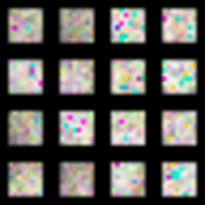
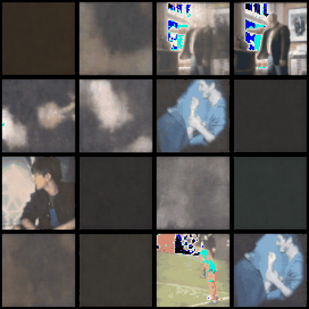
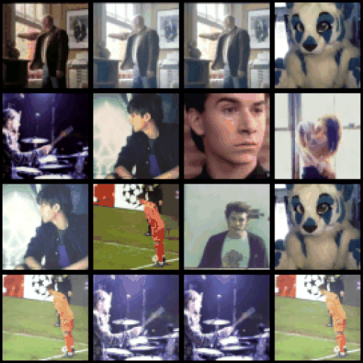

# Median Denonising Difussion Probabilistic Models
Probabilistic Difussion Models where introduced in 2019 by *[Ho et.al](https://arxiv.org/abs/2006.11239)* introducing a pattern for distribution learning via the addition and extracting of gaussian noise into the distribution. 
The following models can be represented as: 
  $$p_\theta(x_0) := \int p_\theta(x_{0:\tau}) \,dx_{1:\tau}$$
  
Where x_1, ..., x_\tau are latent variables of the same dimensionality and data is represented by x_0 ~ q(x_0), which joint distribution 
$$p_\theta(x_{0:\tau})$$ is the reverse is defined by the following Markov chain: 
```math
p_\theta(x_{0:T}):= p(x_T)\prod_{t=1}^Tp_\theta(x_{t-1}|X_t),  p_\theta(x_{t-1}|x_t):= \nu_\theta(x_{t-1}; \mu_\theta(x_t,t), \sum_\theta(x_t, t))     
```
With a forward process defined as: 

$$q(x_{1_\tau}|x_0):= \sum_{t=1}^\tau q(x_t|x_{t-1}), q(x_t|x_t-1):= \nu(x_t; \sqrt{1-\beta_tx_{t-1}},\beta,\iota)$$

And training: 
```math 
\mathcal{E}[-logp_\theta(x_0) \leq \mathcal{E}_q[-log\frac{p_\theta(x_{0:\tau}}{q(x_{1:\tau}|x_0} = \mathcal{E}_q[-logp(x_\tau) - \sum_{t \geq 1} log \frac{p_\theta(x_{t-1}|x_t}{q(x_t|x_{t-1})}] =: L
```
In the aim of reducing the number operation necessary to go through the difussion process, median gaussian was introduced, with

The forward process defined as: 
$$q(x_{1_\tau} | \frac{x_0 + x_{-1}}{2}) := \sum_{t=1}^\tau q(x_t | \frac{x_{t-1} + x_{t-2}}{2}), \quad q(x_t | \frac{x_{t-1} + x_{t-2}}{2}) := \nu(x_t; \sqrt{1-\beta_t} \frac{x_{t-1}+x_{t-2}}{2}, \beta, \iota)$$

And training: 
```math 
\begin{align*}
\mathcal{E}\left[-\log p_\theta(x_0) \leq \mathcal{E}_q\left[-\log\frac{p_\theta(x_{0:\tau})}{q\left(\frac{x_{1:\tau} + x_{2:\tau}}{2}\Big|x_0\right)}\right]\right] &= \mathcal{E}_q\left[-\log p(x_\tau) - \sum_{t \geq 1} \log \frac{p_\theta\left(\frac{x_{t-1} + x_{t-2}}{2}\Big|x_t\right)}{q\left(x_t\Big|\frac{x_{t-1} + x_{t-2}}{2}\right)}\right] = L
\end{align*}
```
## About the Data
The dataset used for training consisted of 3-5 second gifs from the TUMBLR-Gif dataset. For reference, visit [here](https://raingo.github.io/TGIF-Release/).

## Results

Below are the displayed GIFs presented in a 4 x 4 grid. The resolution was downsampled to meet computational requirements.

**First steps of model without hybrid-noise**  
 


Hybrid noise was added to the model, which improved its performance and allowed it to converge faster. The final result is shown in the last image above. This shows that adding hybrid noise results in higher quality.

**Results for hybrid noise**  



